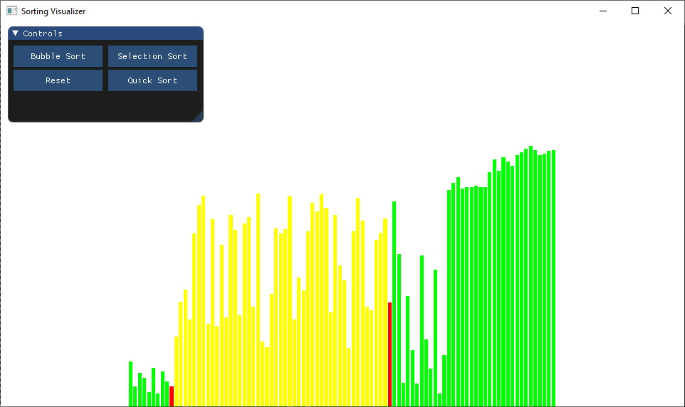
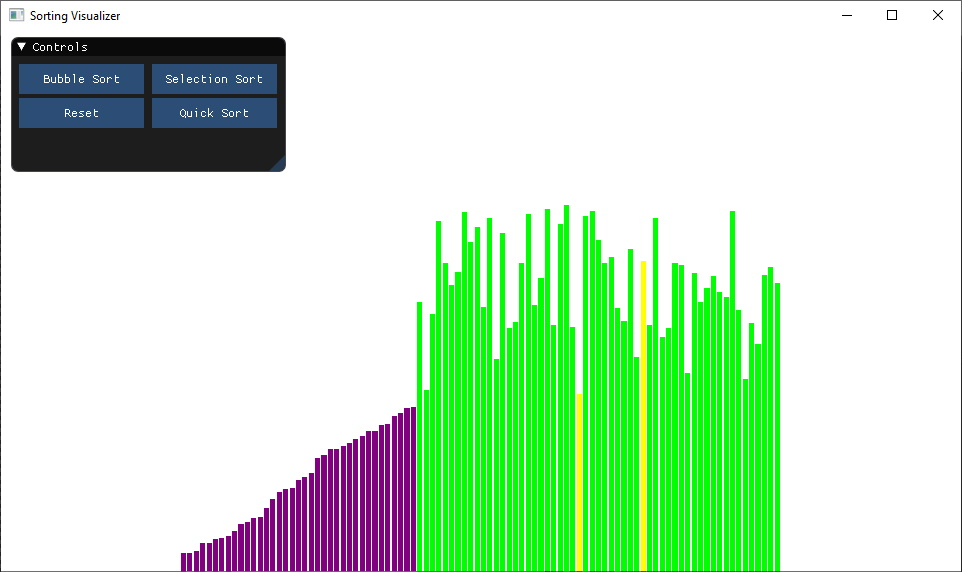

# Sorting Visualiser
This application visualises different sorting algorithms using OpenGL.
My main goal for this project was to learn various different sorting algorithms as well
as the basics of batch rendering in graphics programming.

## Preview

## Building

  The application can be built with [Maven](https://maven.apache.org/):
    
    mvn clean package
    
  The jar file will be available in the `./target` directory.
  
## Controls
  Everything within this application can be controlled via the onscreen GUI.
  However there are also various keybinds for those actions:
  
  <kbd>B</kbd> for bubble sort.
  
  <kbd>I</kbd> for selection sort.
  
  <kbd>A</kbd> to randomise the data.
  
## Configuration

**GUI**

    The UI presents you with buttons to enable each sorting algorithm as 
    well as randomise the data via a pure java binding of ImGUI. 
    
## Libraries

* [LWJGL 3](https://www.lwjgl.org/) (minimal OpenGL configuration)
* [JOML](https://github.com/JOML-CI/JOML) (math library)
* [Dear ImGUI](https://github.com/SpaiR/imgui-java) (pure java binding of the C++ UI library)

## Credits

* [Clément Mihailescu](https://github.com/clementmihailescu) for the idea from his project in JS